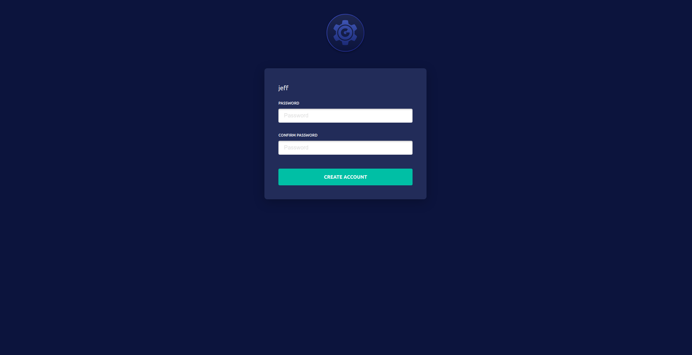
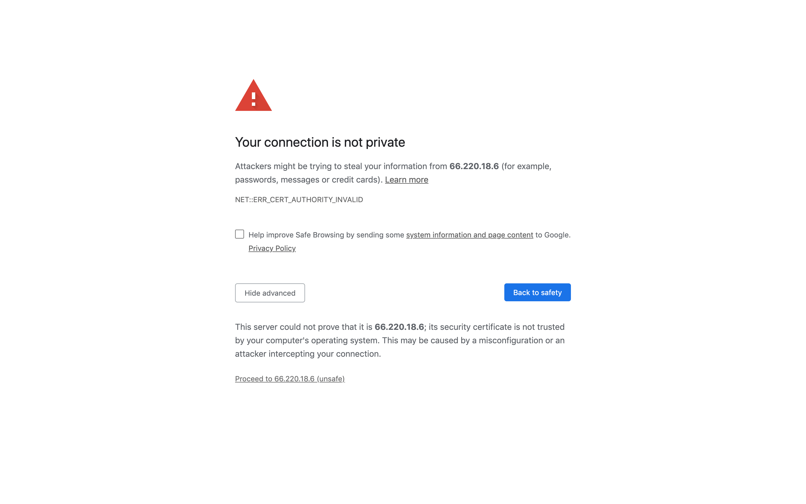
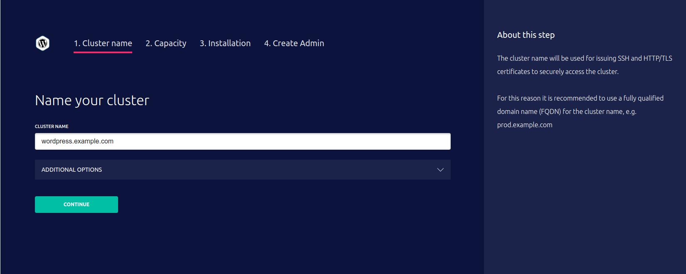
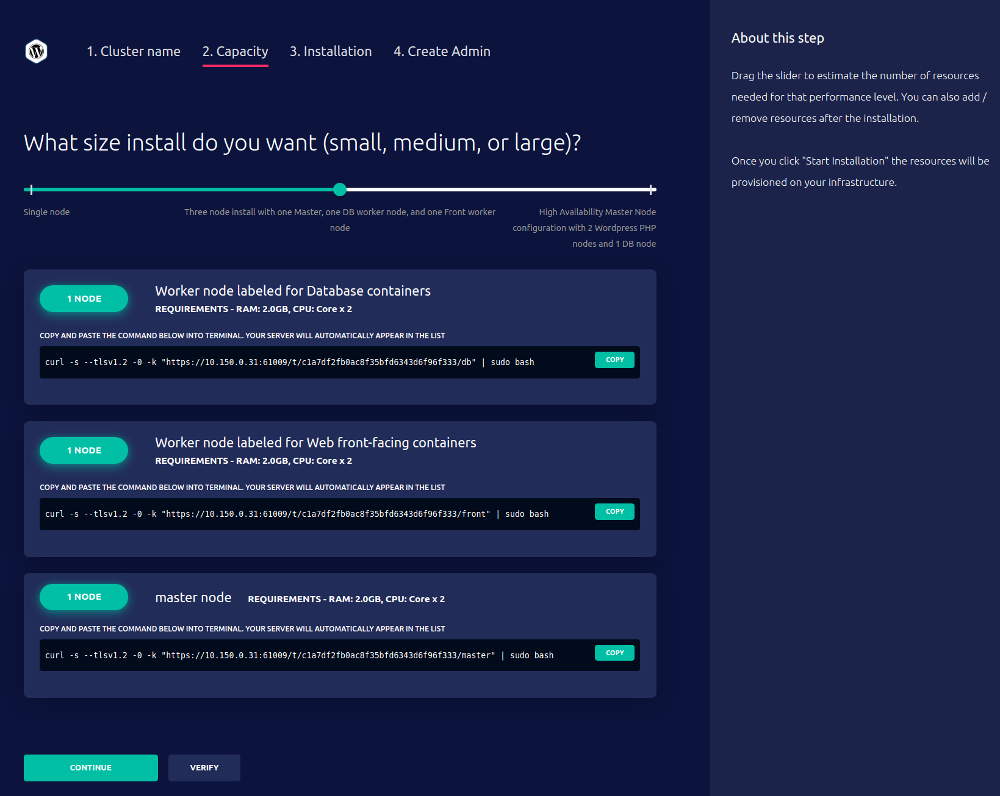
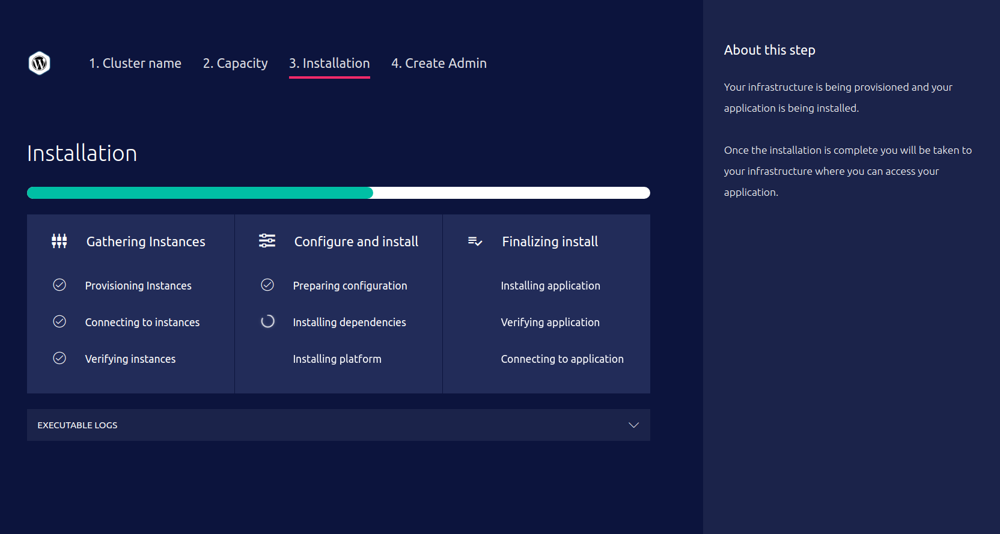
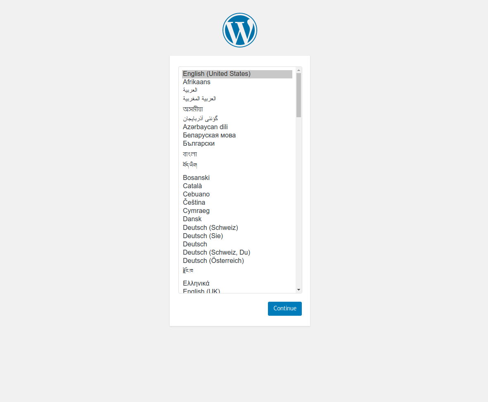
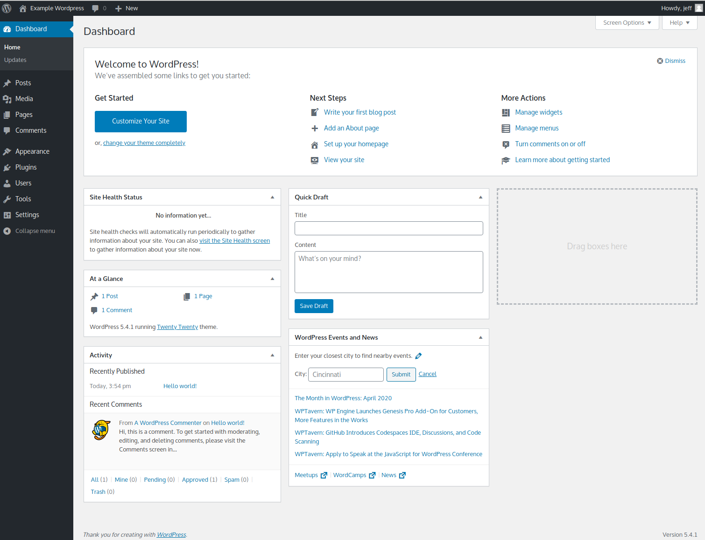

# Introduction

This guide will help you quickly evaluate Gravity by packaging, and installing
a sample Kubernetes application.

We will use [Wordpress](https://www.wordpress.org/), an open source content management
application. Wordpress represents a fairly typical web application
and consists of a front-end web application connecting to a MySQL
instance.

Before we start, you may want to go over the [Gravity Overview](index.md) to
get familiar with basic concepts of the Gravity solution.


## System Requirements

Gravity is a Kubernetes packaging solution so it only runs on computers capable
of running Kubernetes. For this tutorial, you will need:

* A x86_64 Linux machine or a VM for building a Cluster Image that is running one of the [supported Linux distributions](requirements.md#linux-distributions).
* Docker version 17 or newer. Run `docker info` before continuing to make sure
  you have Docker up and running. We recommend following instructions on [installing Docker CE from Docker.com](https://docs.docker.com/install/)
* You must be a member of the `docker` group. Run `groups` command to make sure
  `docker` group is listed. If not, you can add yourself to the "docker" group via `sudo usermod -aG docker $USER`
* You must have `git` installed to clone the example application repo.
* A _target cluster_ of Linux nodes. It can be just one machine and we also show how to deploy to three. The nodes in a target cluster must have at least 2GB of RAM and 40GB of free disk space. They must **_not_** have Docker installed on them.
* You must have `sudo` privileges on all nodes.

## Step 1 Getting the Tools

Start by [downloading Gravity](https://gravitational.com/gravity/download/) and
unpacking the archive. You should see the following files:
```
$ ls -l
-rwxr-xr-x 1 user user 108093824 Apr 22 11:43 gravity
-rwxr-xr-x 1 user user       137 Apr 22 11:43 install.sh
-rw-r--r-- 1 user user     11357 Apr 22 11:43 LICENSE
-rw-r--r-- 1 user user      2880 Apr 22 11:43 README.md
-rwxr-xr-x 1 user user  84764672 Apr 22 11:43 tele
-rwxr-xr-x 1 user user  57863592 Apr 22 11:43 terraform-provider-gravity
-rwxr-xr-x 1 user user  32488888 Apr 22 11:43 tsh
-rw-r--r-- 1 user user         6 Apr 22 11:43 VERSION
```

Execute `install.sh` to copy `tele` and `tsh` binaries to
`/usr/local/bin/`. Then you can type `tele version` to confirm that
everything works:

```
$ tele version
Edition:        open-source
Version:        7.0.4
Git Commit:     a16e2074bf9b88f69719b80b9b7d178cc1ce6349
Helm Version:   v2.15
```

Clone the sample Git repository which contains the Kubernetes resources for
[Wordpress](https://www.wordpress.org/), which we are using in this tutorial as a sample application:

```bsh
$ git clone https://github.com/gravitational/gravity.git
$ cd gravity/examples
```

## Building a Cluster Image

To build a Cluster Image we'll perform the following steps:

1. Create Docker containers for application services.
2. Create definitions of Kubernetes resources (pods, etc) for application
   components. This makes an application capable of running on Kubernetes.
   You can place all Kubernetes resource files (usually in YAML format) in the
   same directory or you can use Helm.
3. Create a Cluster Image Manifest to describe the system requirements
   for a Kubernetes cluster capable of running your application. A Cluster Image Manifest
   is a YAML file which allows you to customize the Cluster Image.
4. Execute `tele build` CLI command.


### Step 2: Creating the Kubernetes Resources

Making Wordpress run on Kubernetes is easy. The Gravity examples repository you have
cloned above includes the YAML definitions of Kubernetes objects. We'll use
a Helm chart for this:

```
$ tree wordpress/resources/charts/wordpress/
wordpress/resources/charts/wordpress/
├── Chart.yaml
├── templates
│   ├── _helpers.tpl
│   ├── mysql-deployment.yaml
│   ├── secret.yaml
│   └── wordpress-deployment.yaml
└── values.yaml

```

The values.yaml specifies several important values including
  - Using OpenEBS for storage
  - Size of the Persistent Storage for Wordpress and MySQL
  - Password for MySQL db.
You are welcome to modify this file and you can use --set and --values in the tele build process to replace these values. In this tutorial, we are packaging a single Helm chart but it is possible to have several of them packaged into a single Cluster Image.

### Step 3: Creating the Cluster Image Manifest

In this step, we create an Image Manifest which describes the system
requirements for the Cluster.

We have already prepared one for this guide in the cloned repo: `wordpress/resources/app.yaml`. You can [open it on Github](https://github.com/gravitational/gravity/blob/master/examples/wordpress/resources/app.yaml) for convenience. We have commented the most important fields
in the example manifest.

### Step 4: Building the Cluster Image

Let's build the cluster image which will consist of a Kubernetes
cluster with Wordpress pre-installed inside:

```bsh
$ tele build -o wordpress.tar wordpress/resources/app.yaml
Mon Apr 27 00:49:02 UTC Building cluster image wordpress 0.0.1
Mon Apr 27 00:49:02 UTC Selecting base image version
        Will use base image version 7.0.4
Mon Apr 27 00:49:02 UTC Downloading dependencies from s3://hub.gravitational.io
        Still downloading dependencies from s3://hub.gravitational.io (10 seconds elapsed)
        Still downloading dependencies from s3://hub.gravitational.io (20 seconds elapsed)
Mon Apr 27 00:50:31 UTC Embedding application container images
        Pulling remote image quay.io/gravitational/debian-tall:0.0.1
        Pulling remote image quay.io/gravitational/debian-tall:stretch
        Pulling remote image quay.io/gravitational/provisioner:ci.82
        Pulling remote image quay.io/gravitational/debian-tall:buster
        Using local image mysql:5.6
        Using local image wordpress:4.8-apache
        Vendored image gravitational/debian-tall:0.0.1
        Vendored image gravitational/debian-tall:stretch
        Vendored image gravitational/debian-tall:buster
        Vendored image gravitational/provisioner:ci.82
        Vendored image mysql:5.6
        Vendored image wordpress:4.8-apache
Mon Apr 27 00:51:21 UTC Creating application
        Still creating application (10 seconds elapsed)
Mon Apr 27 00:51:36 UTC Generating the cluster image
Mon Apr 27 00:51:44 UTC Saving the image as wordpress.tar
        Still saving the image as wordpress.tar (10 seconds elapsed)
Mon Apr 27 00:52:02 UTC Build finished in 3 minutes
```

Let's review what just happened. `tele build` did the following:

* Downloaded Kubernetes binaries and Gravity tooling from Gravitational distribution hub.
* Scanned the current directory and the subdirectories for Kubernetes resources and Helm charts.
* Downloaded external container images referenced in the resources discovered in the previous step.
* Packaged (or vendored) Docker images into the Cluster Image.
* Removed the duplicate container image layers, reducing the size of the Cluster Image.
* Saved the Cluster Image as `wordpress.tar`.

Note: Slow Operation Warning
    `tele build` needs to download hundreds of megabytes of binary dependencies which
    can take a considerable amount of time, depending on your Internet connection speed.

The resulting `wordpress.tar` file is about 2.9GB and it is **entirely
self-sufficient** and dependency-free. It contains everything: the Kubernetes
binaries, the Docker engine, the Docker registry and the Wordpress application itself:
everything one needs to get Wordpress up and running on any fleet of Linux
servers (or into an AWS/GCE/Azure account).

Congratulations! You have created your first **Kubernetes virtual appliance**!

## Installing

Installing the `wordpress.tar` Cluster Image results in creating a Kubernetes
cluster with the application pre-loaded. This file is the only artifact
one needs to create a Kubernetes cluster with Wordpress running inside.

Copy `wordpress.tar` to a clean Linux machine. Let's call it `host`. This node
will be used to bootstrap the cluster. Let's untar it and look inside:

```bash
$ tar -xf wordpress.tar
$ tree
├── app.yaml
├── gravity
├── gravity.db
├── install
├── packages
│   ├── blobs
│   │   ├── 0e1
│   │   ...
│   │   └── ff1
│   │       └── ff19bcf2dc62f037e0016d5d065150d195f714be3c97a301791365a4ec5a43f0
│   ├── tmp
│   └── unpacked
├── README
├── upgrade
└── upload
```

Here is a brief description of these files:

File Name    | Description
-------------|------------------------
`gravity`    | Gravity Cluster manager which is a Linux binary (executable). It's responsible for installing, upgrading and managing clusters.
`app.yaml`   | The Image Manifest which we've defined earlier and fed to `tele build`. You'll notice that the build process populated the manifest with additional metadata.
`packages`   | The database of Docker image layers for all containers and other binary artifacts, like Kubernetes binaries.
`gravity.db` | The metadata of what's stored in `packages`.
`upgrade`, `install`, `upload` | Helpful bash wrappers around `gravity` commands.
`README`     | Instructions for the end user.

Gravity supports two modes of installation:

* **CLI mode** or non-interactive mode is useful for advanced users
  and for scripting. It allows clusters to be created programmatically or via
  command line.
* **Web mode** uses a web browser to guide a user through an installation wizard.
  This mode is useful for non-technical users, sales demos, etc.

### Installing via CLI

To install a Cluster via CLI, you have to execute the `./gravity install` command and
supply three flags:

Flag              | Description
-------------------|---------------------------------
`--token`          | A secret token of your choosing which will be used to add additional nodes to this Cluster in the future. We'll use word "secret" here.
`--advertise-addr` | The IP address this host will be visible on by other nodes in this Cluster. We'll use `10.5.5.28`.
`--cloud-provider` | Whether in a specific cloud environment or a no-cloud provider such as standalone VMs/bare-metal environment [generic aws gce] We'll use `generic` here.

The command below will create a single-node Kubernetes cluster with Wordpress running inside:

```
# We are executing this on the node named 'host' with IP address of 10.5.5.28
$ sudo ./gravity install \
        --advertise-addr=10.5.5.28 \
        --token=secret \
        --cloud-provider=generic
# Output:
Sun Apr 26 23:55:11 UTC Starting enterprise installer

To abort the installation and clean up the system,
press Ctrl+C two times in a row.

If you get disconnected from the terminal, you can reconnect to the installer
agent by issuing 'gravity resume' command.

If the installation fails, use 'gravity plan' to inspect the state and
'gravity resume' to continue the operation.
See https://gravitational.com/gravity/docs/cluster/#managing-an-ongoing-operation for details.

Sun Apr 26 23:55:11 UTC Connecting to installer
Sun Apr 26 23:55:32 UTC Connected to installer
Sun Apr 26 23:55:32 UTC Successfully added "master" node on 10.150.15.236
...

Mon Apr 27 00:03:05 UTC Install application wordpress:0.0.1
Mon Apr 27 00:03:05 UTC Executing install hook for wordpress:0.0.1
Mon Apr 27 00:03:15 UTC         Still executing install hook for wordpress:0.0.1 (10 seconds elapsed)
Mon Apr 27 00:03:16 UTC Executing "/connect-installer" locally
Mon Apr 27 00:03:17 UTC Connecting to installer
Mon Apr 27 00:03:17 UTC Connect to installer
Mon Apr 27 00:03:19 UTC Executing "/election" locally
Mon Apr 27 00:03:19 UTC Enable leader elections
Mon Apr 27 00:03:19 UTC Enable cluster leader elections
Mon Apr 27 00:03:20 UTC Executing operation finished in 6 minutes
Mon Apr 27 00:03:20 UTC The operation has finished successfully in 7m48s
Mon Apr 27 00:03:21 UTC
Cluster endpoints:
    * Authentication gateway:
        - 10.150.15.236:32009
    * Cluster management URL:
        - https://10.150.15.236:32009

Application endpoints:
    * wordpress:0.0.1:
        - wordpress:
            - http://10.150.15.236:30080

```

**Congratulations!** You have created a fully functional Kubernetes cluster
with Wordpress running inside. To check the health and status of the Cluster,
execute this command on the target node:

```bash
$ sudo gravity status
Cluster name:           wordpress
Cluster status:         active
Cluster image:          wordpress, version 0.0.1
Gravity version:        7.0.4 (client) / 7.0.4 (server)
Join token:             c2d3757aec3e50d210e189dc16b1fb37
Periodic updates:       Not Configured
Remote support:         Not Configured
Last completed operation:
    * 1-node install
      ID:               e5608f31-0d8e-4399-9987-00a96f0b41f8
      Started:          Sun Apr 26 23:55 UTC (1 hour ago)
      Completed:        Sun Apr 26 23:57 UTC (1 hour ago)
Cluster endpoints:
    * Authentication gateway:
        - 10.150.15.236:32009
    * Cluster management URL:
        - https://10.150.15.236:32009
```
Navigate to `http://<node ip>:30080` to access the application.

**Note** that this is a single node deployment example.  You have the option of [joining](https://gravitational.com/gravity/docs/cluster/#adding-a-node) or installing with a different flavor.  The default flavor for this Cluster Manifest is small (1 node).  Other flavors include medium (3 nodes) and large (5 nodes).
```
#Ex:

$ sudo ./gravity install \
        --advertise-addr=10.5.5.28 \
        --token=secret \
        --cloud-provider=generic \
        --flavor=medium
```

Flavor details are in the Wordpress [Cluster Manifest](https://github.com/gravitational/gravity/blob/master/examples/wordpress/resources/app.yaml). Flavors provide for specifying the number and configuration of nodes for a deployment.

## Adding a User
The next step is to create a new Kubernetes user:

```bash
# execute this on the K8s master node (running on 10.5.5.28 in our example)
# to create a user "jeff"
$ gravity users add --roles=@teleadmin  jeff

# output:
Signup token has been created and is valid for 8h0m0s hours. Share this URL with the user:
https://10.150.15.236:3009/web/newuser/e5b5422da69ff44d41f92e3ce6167659a7fee10e1023acea22062141dfe0238e
```




Now click on the printed URL and select a password. You are now inside the Cluster
Control Panel. You can bookmark the following URL to access it in the future: `https://10.5.5.28:32009/web/`


You will also see that this Cluster is running Wordpress inside, accessible as a Kubernetes service
on port `30080`, i.e. it's accessible using IP addresses of both machines in the Cluster:

* `http://10.5.5.28:30080/`
* `http://10.5.5.29:30080/`
* `http://10.5.5.30:30080/`

### Installing via Web Browser

This method of installation launches a graphical installation wizard in a web browser.

To launch a web installer, you will need:

* The Cluster Image `wordpress.tar` which we have prepared earlier.
* A Linux computer with a graphical interface and web browser connected to the same network as the target nodes.

First, untar `wordpress.tar` and execute the `./gravity install --wizard` command. This command
launches an HTTP server which serves a web UI and acts as a bootstrapping agent
to create a new Cluster. It will print a web URL for you to click
on or paste in your browser.

```bash
$ sudo ./gravity install --wizard
OPEN THIS IN BROWSER: https://host:61009/web/installer/new/gravitational.io/wordpress/0.0.1?install_token=2a9de4a72ede
```

**If you don't have TLS setup you might see this error message. Click Advanced -> Proceed **


The browser-based installer will ask for the following:

* Name of your Cluster. We recommend FQDN-like names like
  `wordpress.example.com`.
* The network interface to use. This must be the interface which Kubernetes
  nodes will use to talk to each other.



* The "flavor" of the Cluster, i.e. small (1 node), medium (2 nodes) or large (5 nodes). The installer will provide a CLI
  command to copy to and execute on each node.



* Once all nodes report into the Cluster, the installer will proceed setting up
  Kubernetes.


The final step is to select the user name and password for the administrator. You will be able to change it later (or configure the SSO). Once you are logged in, you will be placed in Gravity's Control Panel UI.  Wordpress will be available at the NodePort of 30080.


**Wordpress Install Complete**



You can press `Ctrl+C` to stop the `install` script.

## Conclusion

This is a brief overview of how Kubernetes clusters can be packaged into simple
`tar` files and then installed anywhere. Gravity's image-based approach is quite
similar to how virtual machines/instances are treated by using disk images in
virtualized environments.

This dramatically lowers the operational overhead of running multiple Kubernetes
clusters within an organization, allows complex SaaS applications to be converted
into downloadable Kubernetes appliances and dramatically simplifies implementing
compliance in organizations by publishing Kubernetes images that are pre-configured and approved by the security and compliance teams.

If you need additional guidance with packaging your Kubernetes clusters into
Gravity deployments, our implementation services team can help (info@gravitational.com).
