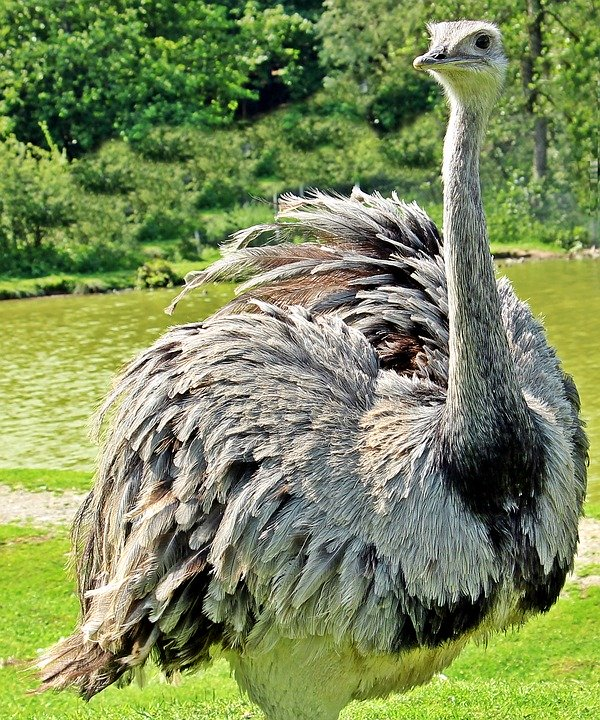

# Introduction

This is a Gravity Cluster Image example using the TensorFlow ResNet (Deep Residual Network) server helm chart (2.0.13) that serves a machine learning (ML) model.  The default model is 
for image classification.  The model is pulled from a public URL specified in the [values.yml](./resources/charts/tensorflow-resnet/values.yml)
and can be configured to other models.  See the [TensorFlow](https://www.tensorflow.org/) website for more information on using ResNet models.

# Example input and output

The TensorFlow ResNet model has 1000 classifications for living creatures and objects.  Here is an example Ostrich graphic image the model will process and provide a tensor classification.




```bash
Welcome to the Bitnami tensorflow-resnet container
Subscribe to project updates by watching https://github.com/bitnami/bitnami-docker-tensorflow-resnet
Submit issues and feature requests at https://github.com/bitnami/bitnami-docker-tensorflow-resnet/issues

calling predict using file: /sampleImages/ostrich.jpg  ...
call predict ok
outputs size is 2
the result tensor[0] is:
10
the result tensor[1] is:
[4.90122887e-10 1.7140348e-09 7.5265244e-10 9.62422142e-10 7.78775e-10 8.07670708e-10 1.95118852e-10 6.64805322e-10 1.48357947e-06 6.94784558e-06...]...
Done.

# Tensor classification retrieval example
Tensor result id retrieve: 10
Classification name: ostrich


```

## Building Cluster Image
To construct the Tensorflow-ResNet Cluster Image with a dependency-free .tar file use this command.  You can then deploy the Tensorflow-ResNet as a self-contained, truly portable application for your preferred infrastructure. 
```bash
tele build -o tensorflowresnet.tar tensorflow-resnet/resources/app.yaml
```

Further details on installing Gravity Cluster Images is available [here](https://gravitational.com/gravity/docs/installation/). 


## Building Application
In addition to Cluster Images, Gravity supports packaging application helm charts as self-contained application images. The application is then deployable in the same manner as helm charts to Gravity clusters. Further information on application packaging deployment is available [here](https://gravitational.com/gravity/docs/catalog/).
```bash
tele build -o tensorflowresnet.tar tensorflow-resnet/resources/charts/tensorflow-resnet
```

## Deployment Configuration

After deploying you will see the following Pod status of initalizing while the model is loaded.

```bash
$ kubectl get po
NAME                                READY   STATUS            RESTARTS   AGE                                                                                                                                                              
tensorflow-resnet-bf8f6f5b6-22pgd   0/1     PodInitializing   0          7s                                                                                                                                                               
tensorflow-resnet-bf8f6f5b6-59fq8   0/1     PodInitializing   0          7s                                                                                                                                                               
tensorflow-resnet-bf8f6f5b6-qbd6v   0/1     PodInitializing   0          7s    
```

Once the model is loaded these pods are available to serve image classifications.
```bash
kubectl get po                                                                                                                                                                                         
NAME                                READY   STATUS    RESTARTS   AGE                                                                                                                                                                      
tensorflow-resnet-bf8f6f5b6-22pgd   1/1     Running   0          37s                                                                                                                                                                      
tensorflow-resnet-bf8f6f5b6-59fq8   1/1     Running   0          37s                                                                                                                                                                      
tensorflow-resnet-bf8f6f5b6-qbd6v   1/1     Running   0          37s
```
```bash
$ kubectl get deployments
NAME                READY   UP-TO-DATE   AVAILABLE   AGE
tensorflow-resnet   3/3     3            3           10m
```

# Image classification

Image classification requests should be done on a machine with Docker installed. Take note of one of the server's available IPs and confirm the available NodePort.  By default it should be 30090. After invoking you will recieve a result tensor.  
The [./tensorClientResources/class.json](./tensorClientResources/class.json) has an array with the names of the results. Note that the classification in the JSON file is one number less then the result.  For example if you gave an image of a hammerhead shark you would
receive the number 5 tensor result which is number 4 below.

```json
{  
  "4": [
    "n01494475",
    "hammerhead"
  ],
  "5": [
    "n01496331",
    "electric_ray"
  ]
  }
```

A convenience script is provided to map the classification number to an English description  See the example below.


## Invoking classificaton

Two example invocations are shown here.  First invoking a local image with a volume mount and the second is with an image from a public URL.

### Image Classification from Local File

Example local image client invocation on myserver1 with nodeport 30090. Substitute `myserver1` with the IP or reachable hostname.

```bash
$ docker run -v $(pwd)/sampleImages/:/sampleImages/  --rm -it bitnami/tensorflow-resnet bash -c "resnet_client_cc --server_port=myserver1:30090 --image_file=/sampleImages/ostrich.jpg"
Unable to find image 'bitnami/tensorflow-resnet:latest' locally
latest: Pulling from bitnami/tensorflow-resnet
20b41457e783: Pull complete 
c97fbd806ec8: Pull complete 
431a77662433: Pull complete 
cfd760178616: Pull complete 
bd8462ed5e56: Pull complete 
fd328fc82771: Pull complete 
2ad6364db09a: Pull complete 
2d8d2584069b: Pull complete 
481c10440f8a: Pull complete 
c759cb1595ec: Pull complete 
Digest: sha256:05183e5446b778503a6151c570a66dafa9fe7ad905aee0f4b0a9c8c9a5519515
Status: Downloaded newer image for bitnami/tensorflow-resnet:latest

Welcome to the Bitnami tensorflow-resnet container
Subscribe to project updates by watching https://github.com/bitnami/bitnami-docker-tensorflow-resnet
Submit issues and feature requests at https://github.com/bitnami/bitnami-docker-tensorflow-resnet/issues

calling predict using file: /sampleImages/ostrich.jpg  ...
call predict ok
outputs size is 2
the result tensor[0] is:
10
the result tensor[1] is:
[4.90122887e-10 1.7140348e-09 7.5265244e-10 9.62422142e-10 7.78775e-10 8.07670708e-10 1.95118852e-10 6.64805322e-10 1.48357947e-06 6.94784558e-06...]...
Done.
```
Getting the Image Classification Name
```bash
$ cd tensorClientResources/
$ ./getimageclassification.sh 10
Tensor result id retrieve: 10
Classification name: ostrich
```


### Image Classification from Public URL

Invoking a public URL on  myserver1 with nodeport 30090. Substitute `myserver1` with the IP or reachable hostname.


```bash
docker run --rm -it bitnami/tensorflow-resnet bash -c "curl -Lo /tmp/cat.jpg https://tensorflow.org/images/blogs/serving/cat.jpg && resnet_client_cc --server_port=myserver1:30090 --image_file=/tmp/cat.jpg"
Welcome to the Bitnami tensorflow-resnet container
Subscribe to project updates by watching https://github.com/bitnami/bitnami-docker-tensorflow-resnet
Submit issues and feature requests at https://github.com/bitnami/bitnami-docker-tensorflow-resnet/issues

  % Total    % Received % Xferd  Average Speed   Time    Time     Time  Current
                                 Dload  Upload   Total   Spent    Left  Speed
100   252  100   252    0     0   2333      0 --:--:-- --:--:-- --:--:--  2333
100 63753  100 63753    0     0   268k      0 --:--:-- --:--:-- --:--:--  268k
calling predict using file: /tmp/cat.jpg  ...
gRPC call return code: 14: DNS resolution failed
gRPC failed.
ubuntu@gravsam8-cluster-node-2:~/currentWordpress/gravity/examples/tensorflow-resnet$ docker run --rm -it bitnami/tensorflow-resnet bash -c "curl -Lo /tmp/cat.jpg https://tensorflow.org/images/blogs/serving/cat.jpg && resnet_client_cc --server_port=35.245.202.120:30090 --image_file=/tmp/cat.jpg"

Welcome to the Bitnami tensorflow-resnet container
Subscribe to project updates by watching https://github.com/bitnami/bitnami-docker-tensorflow-resnet
Submit issues and feature requests at https://github.com/bitnami/bitnami-docker-tensorflow-resnet/issues

  % Total    % Received % Xferd  Average Speed   Time    Time     Time  Current
                                 Dload  Upload   Total   Spent    Left  Speed
100   252  100   252    0     0   6000      0 --:--:-- --:--:-- --:--:--  6000
100 63753  100 63753    0     0   263k      0 --:--:-- --:--:-- --:--:--  404k
calling predict using file: /tmp/cat.jpg  ...
call predict ok
outputs size is 2
the result tensor[0] is:
[2.41628277e-06 1.90121978e-06 2.72477064e-05 4.42638907e-07 8.98362202e-07 6.84421821e-06 1.66555365e-05 3.42984436e-06 5.25692076e-06 2.66781899e-05...]...
the result tensor[1] is:
286
Done.

# get the image classification name
Tensor result id retrieve: 286
Classification name: Egyptian_cat
```

